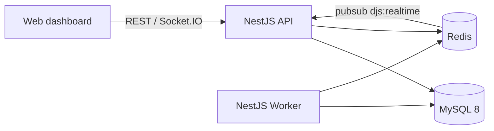
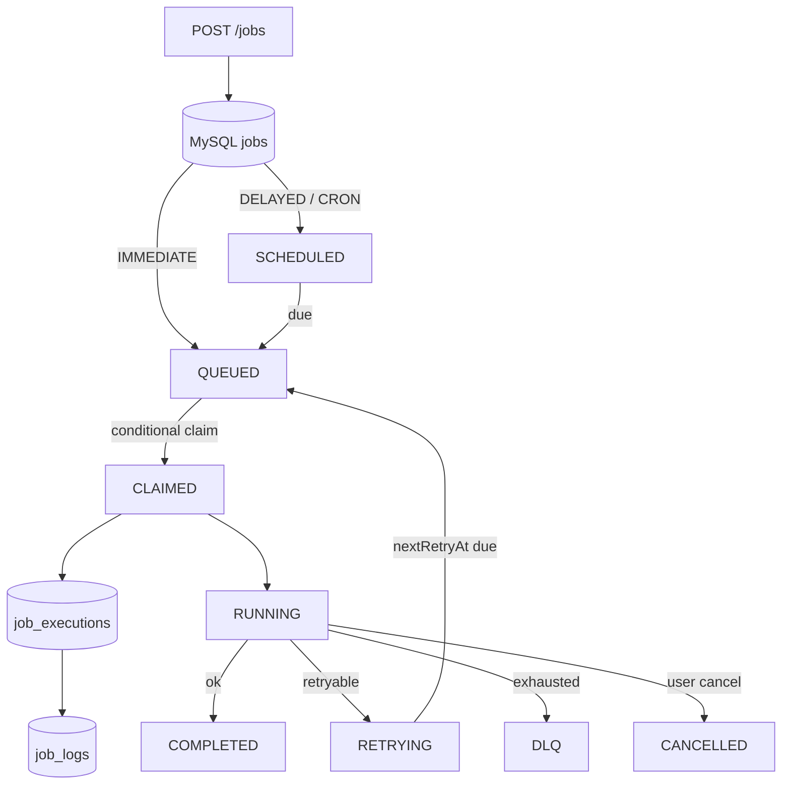

# Architecture

Phase 18 finalizes documentation. The platform is a production-inspired **distributed job scheduler**: NestJS API + NestJS workers + React dashboard, with MySQL as the system of record and Redis for realtime coordination and health.

## Job lifecycle

## Components

| Component | Path | Responsibility |
|-----------|------|----------------|
| API | `apps/api` | Auth, orgs/projects/queues, jobs, DLQ, schedules, dashboard, metrics, Socket.IO gateway |
| Worker | `apps/worker` | Register, heartbeat, claim/execute, retry/DLQ, stale recovery, graceful drain |
| Web | `apps/web` | Ops dashboard, job explorer, workers, DLQ, live updates |
| Shared types | `packages/shared-types` | Status enums, retry math, cron helpers, contracts |
| Prisma | `prisma/` | Schema + migrations (source of truth) |
| Docs | `docs/` | Architecture, ER, API, concurrency, reliability, decisions, deployment |

## Worker loop

1. Register row in `workers` (`STARTING` → `ONLINE`); persist heartbeats to `workers.lastHeartbeatAt` + `worker_heartbeats`.
2. Periodically run stale recovery (mark silent workers `FAILED`, free orphaned `CLAIMED`/`RUNNING` jobs).
3. Promote due `SCHEDULED` / `RETRYING` jobs to `QUEUED`.
4. Claim next job: candidate batch → lock queue row → hard capacity check → conditional `QUEUED → CLAIMED` (+ create `JobExecution`).
5. Mark execution `RUNNING`, write start log; run handler under `AbortController` timeout.
6. On success → execution `COMPLETED` + result JSON (recurring CRON jobs return to `SCHEDULED`).
7. On failure → execution `FAILED`/`TIMEOUT` + error fields; job `RETRYING` or `DLQ`.
8. On user cancel → job `CANCELLED`; open executions closed as `CANCELLED`; worker cooperatively stops.
9. On SIGTERM/SIGINT → stop polling, mark `DRAINING`, wait for in-flight jobs (grace), then `OFFLINE`.

## Redis role

- Health checks for API/worker readiness
- Pub/Sub channel `djs:realtime` so workers publish and the API broadcasts to Socket.IO rooms
- Pub/Sub channel `djs:dispatch` wake hints so workers claim sooner after enqueue (poll remains fallback)
- Fixed-window rate-limit counters and short-lived locks for recovery/promote sweeps

Job **claim state** is **not** Redis-backed; see [design-decisions.md](./design-decisions.md) and [rate-limit-dispatch.md](./rate-limit-dispatch.md).

## Further reading

Start at [README.md](./README.md) (docs index). Critical paths: [concurrency.md](./concurrency.md), [reliability.md](./reliability.md), [database-design.md](./database-design.md).
