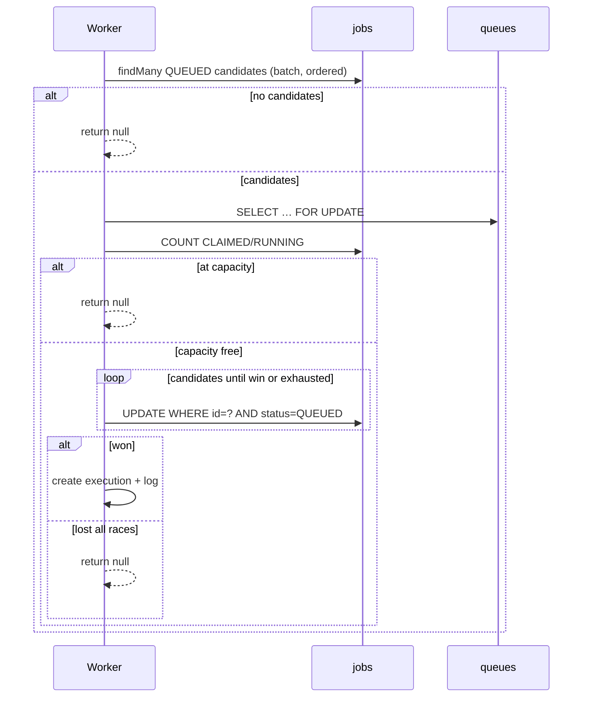

# Concurrency and atomic claiming

Phase 7 documents how multiple workers safely share work without double-execution and without exceeding per-queue concurrency.

## Threat model

| Failure | Risk | Mitigation |
|---------|------|------------|
| Two workers claim the same job | Duplicate side effects | Conditional `UPDATE … WHERE status = 'QUEUED'` (exactly one row affected) |
| Soft capacity check races | More than `maxConcurrency` in-flight | Lock the `queues` row `FOR UPDATE`, then re-count `CLAIMED`/`RUNNING` |
| `SKIP LOCKED` + `ORDER BY LIMIT 1` under load | Waiters see **zero** rows instead of the next job | Do not rely on that pattern; read a candidate batch, then conditional UPDATE |
| Worker crashes mid-run | Job stuck in `CLAIMED`/`RUNNING` | Heartbeat timeout recovery ([heartbeat-recovery.md](./heartbeat-recovery.md)) |
| Poll storms when capacity full | Busy spin | Claim returns null; next attempt waits `WORKER_POLL_INTERVAL_MS` |

## Claim algorithm



1. **Candidate batch** — Read up to 24 `QUEUED` jobs on `ACTIVE` queues, ordered by `priority DESC`, `createdAt ASC` (no row locks yet).
2. **Queue lock** — `SELECT … FROM queues WHERE id = ? FOR UPDATE` serializes capacity decisions for that queue.
3. **Hard capacity check** — Count jobs in `CLAIMED` or `RUNNING`. If `>= maxConcurrency`, abort.
4. **Conditional claim** — Walk candidates; `updateMany` succeeds only when `status` is still `QUEUED`. Exactly one worker can flip a given row.
5. **Audit** — Create `job_executions` (`CLAIMED`) and a claim log line under the same transaction.

Isolation level is `READ COMMITTED`. We do not rely on `SERIALIZABLE`.

### Why not `FOR UPDATE SKIP LOCKED` alone?

MySQL 8’s `SELECT … ORDER BY … LIMIT 1 FOR UPDATE SKIP LOCKED` is attractive, but under parallel claimers we observed waiters receiving **no row** while unlocked `QUEUED` siblings remained — so a queue with `maxConcurrency > 1` could under-utilize. Conditional UPDATE after a non-locking candidate read avoids that footgun while still preventing double-claim.

## Worker process concurrency

`WORKER_CONCURRENCY` caps how many jobs a **single process** executes at once (`activeJobIds`). That is independent of queue `maxConcurrency`, which caps how many jobs across **all workers** may be in-flight for one queue.

Effective parallelism for a queue is:

```text
min(queue.maxConcurrency, sum(worker.concurrency across ONLINE workers))
```

## Indexes that matter

- `jobs (queueId, status, priority, createdAt)` — candidate ordering
- `jobs (queueId, status)` — capacity counts
- `queues (status)` — active queue filter

## Tests

`apps/worker/test/claim-concurrency.e2e-spec.ts` runs against the real MySQL database:

- Many parallel claimers, one job → exactly one winner
- `maxConcurrency = 1` with several queued jobs → exactly one `CLAIMED` after a burst
- `maxConcurrency = 2` → exactly two in-flight after a burst

### Running the stress tests

```bash
# Prefer no competing worker process (or set WORKER_DISABLE_CLAIM=true and restart worker)
npm run test:e2e -w @djs/worker
```

`WORKER_DISABLE_CLAIM=true` keeps the worker process healthy (heartbeats) without polling claims — useful while running claim stress tests against a shared MySQL.

## What this phase does not cover

- Redis/BullMQ as a dispatch layer (later); MySQL remains source of truth for claim state
- Exactly-once side effects inside task handlers (handlers should be idempotent; claim is at-most-once per attempt)

Stale lock recovery after worker death is covered in [heartbeat-recovery.md](./heartbeat-recovery.md).
