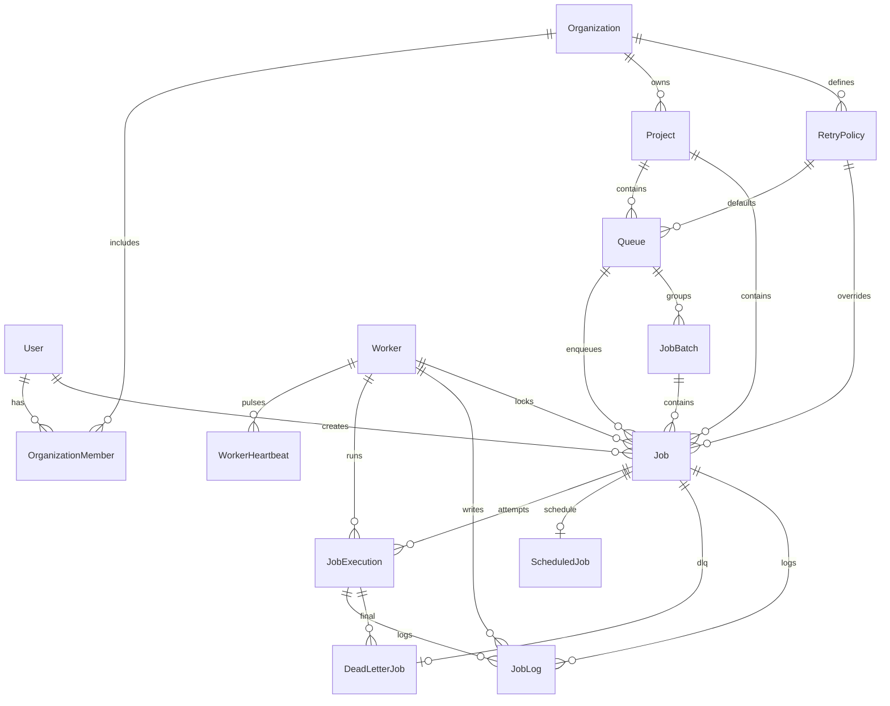

# Database design

MySQL 8 is the **system of record** for identity, queue configuration, jobs, executions, retries, workers, logs, schedules, and DLQ entries. Redis is used for realtime pub/sub and health checks — not as the job queue (see [design-decisions.md](./design-decisions.md)).

All timestamps are UTC (`DateTime(3)`). Primary keys are string `cuid` values unless noted.

## ER diagram

## Cardinality

| Parent | Child | Cardinality | Notes |
|--------|-------|-------------|--------|
| User | OrganizationMember | 1:N | A user may belong to many orgs |
| Organization | OrganizationMember | 1:N | Unique `(organizationId, userId)` |
| Organization | Project | 1:N | Unique project `slug` per org |
| Organization | RetryPolicy | 1:N | Unique policy `name` per org |
| Project | Queue | 1:N | Unique queue `name` per project |
| Project | Job | 1:N | Jobs never leave their project |
| Queue | Job | 1:N | Claim and stats are queue-scoped |
| Queue | JobBatch | 1:N | Batch submission envelope |
| Job | JobExecution | 1:N | One row per attempt; never overwrite |
| Job | ScheduledJob | 1:0..1 | Recurring/one-time definition |
| Job | DeadLetterJob | 1:0..1 | At most one DLQ record per job |
| Job | JobLog | 1:N | Application logs for the job |
| Worker | WorkerHeartbeat | 1:N | Subject to retention cleanup |
| Worker | JobExecution | 1:N | Optional once worker row is gone |

## Primary keys and unique constraints

| Table | PK | Additional unique |
|-------|----|-------------------|
| `users` | `id` | `email` |
| `organizations` | `id` | `slug` |
| `organization_members` | `id` | `(organizationId, userId)` |
| `projects` | `id` | `(organizationId, slug)` |
| `retry_policies` | `id` | `(organizationId, name)` |
| `queues` | `id` | `(projectId, name)` |
| `jobs` | `id` | `(projectId, idempotencyKey)` |
| `job_executions` | `id` | `(jobId, attemptNumber)` |
| `workers` | `id` | `workerId` (stable instance identity) |
| `scheduled_jobs` | `id` | `jobId` |
| `refresh_tokens` | `id` | `tokenHash` |

`idempotencyKey` is nullable. MySQL unique indexes allow multiple `NULL`s, so jobs without a key do not collide.

## Foreign keys and cascading

**Rule:** do not cascade-delete audit history.

| FK | On delete |
|----|-----------|
| Member → User / Organization | `Cascade` — membership is not history |
| Project → Organization | `Restrict` |
| RetryPolicy → Organization | `Restrict` |
| Queue → Project / RetryPolicy | `Restrict` |
| Job → Project / Queue / RetryPolicy | `Restrict` |
| Job → User (creator) | `SetNull` |
| Job → JobBatch | `SetNull` |
| Job.lockedBy → Worker.workerId | `SetNull` |
| JobExecution → Job | `Restrict` |
| JobExecution → Worker | `SetNull` |
| JobLog → Job / Execution | `Restrict` |
| JobLog → Worker | `SetNull` |
| ScheduledJob → Job | `Restrict` |
| DeadLetterJob → Job / Execution | `Restrict` |
| Heartbeat → Worker | `Cascade` — heartbeats are not business-critical |
| RefreshToken → User | `Cascade` — sessions die with the account |

Deleting an organization that still has projects is rejected. Archive projects and drain queues in application code before any destructive admin action.

## Indexes (beyond uniques)

Claim and list paths are composite and left-prefixed for MySQL:

- `jobs (queueId, status)`
- `jobs (queueId, priority)`
- `jobs (queueId, createdAt)`
- `jobs (queueId, status, priority, createdAt)` — atomic claim order: priority DESC, createdAt ASC (sort applied in SQL)
- `jobs (status, scheduledAt)` / `(status, nextRetryAt)` — scheduler and retry sweeper
- `jobs (projectId)`, `(idempotencyKey)`, `(lockedBy, status)`, `(taskType)`
- `queues (projectId)`, `(status)`, `(projectId, status)`
- `job_executions (jobId)`, `(workerId)`, `(status)`, `(createdAt)`
- `job_logs (jobId, createdAt)`, `(executionId, createdAt)`, `(workerId, createdAt)`
- `worker_heartbeats (workerId, heartbeatAt)`
- `scheduled_jobs (active, nextRunAt)`
- `dead_letter_jobs (createdAt)`, `(resolvedAt)`
- `workers (status)`, `(lastHeartbeatAt)`

Pagination must always include a limiting `WHERE` plus `ORDER BY` that matches these indexes. Never `SELECT * FROM jobs` unbounded.

## Normalization

Third-normal-form for business entities:

- Queue configuration lives on `queues`, not copied onto every job (jobs may override `retryPolicyId`, `priority`, `maxAttempts`, `timeoutMs`).
- Execution attempts are rows in `job_executions`, not mutated columns on `jobs`. `jobs.status` is a **cache of current state** for listing and claiming.
- Recurring definitions live in `scheduled_jobs`; each fire still creates/uses job + execution rows.
- Worker liveness: `workers.lastHeartbeatAt` for cheap health queries; `worker_heartbeats` for history.

JSON is used only for unstructured payloads (`payload`, `result`, `metadata`). Status, identity, and time fields are typed columns.

## Transaction boundaries

Keep transactions short. Do **not** run job handlers inside a DB transaction.

| Operation | Why a transaction |
|-----------|-------------------|
| Job claim | Queue `FOR UPDATE` + conditional `QUEUED→CLAIMED` + insert `job_executions` |
| Job create + schedule | Job row and `scheduled_jobs` row appear together |
| Completion | Job status + execution result |
| Retry | Job `RETRYING`/`QUEUED` + `nextRetryAt` |
| DLQ move | Job `DLQ` + `dead_letter_jobs` upsert |
| Batch create | All jobs in a `job_batches` envelope, or none |
| Org membership change | Member row + any default project grants |

## Retention

Configured via environment (not auto-deleting executions):

- `JOB_LOG_RETENTION_DAYS` (default 30) — delete old `job_logs` only
- `HEARTBEAT_RETENTION_DAYS` (default 7) — delete old `worker_heartbeats` only

Job rows, executions, and DLQ records are retained until an explicit admin/archive process is implemented.

## Performance considerations

- Claim queries must be queue-scoped and status-filtered so they hit `(queueId, status, priority, createdAt)`.
- Dashboard counts should use `GROUP BY status` with queue/project filters, not load all jobs.
- Heartbeat writes are append-only and pruned; do not store unbounded history.
- `errorStack` is `TEXT`; list APIs must not select it by default.
- Connection pooling is process-local (API pool + each worker pool). Size pools below MySQL `max_connections`.

## Likely bottlenecks

1. Hot queue claim contention under high concurrency (mitigated by candidate-batch + conditional UPDATE; see [concurrency.md](./concurrency.md)).
2. Unbounded job-list queries without indexes matching `ORDER BY`.
3. Heartbeat insert volume if interval is too low and retention is off.
4. Large JSON payloads in `payload` / `result` (prefer external object storage for big blobs).
