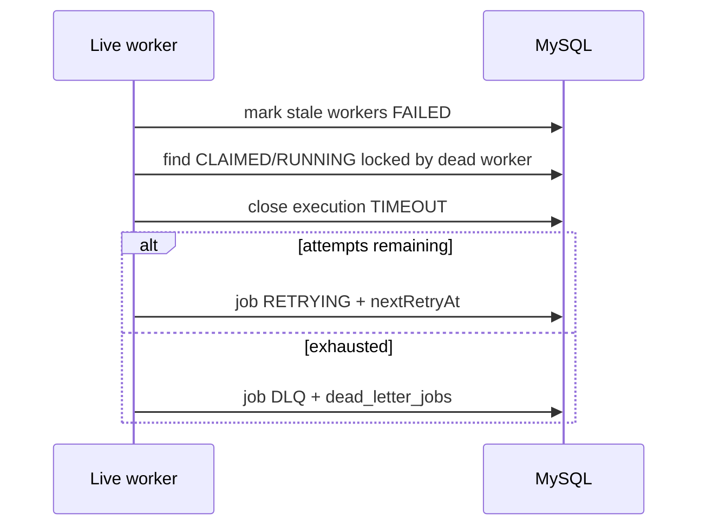

# Heartbeat and stale-worker recovery

Phase 12 closes the reliability gap when a worker process dies mid-job without graceful drain.

## Heartbeats

Each worker:

1. Registers a `workers` row (`STARTING` → `ONLINE`).
2. Writes `workers.lastHeartbeatAt` + appends `worker_heartbeats` every `HEARTBEAT_INTERVAL_MS` (default 5s).
3. On SIGTERM/SIGINT: `DRAINING` → wait for in-flight jobs → `OFFLINE`.

`HEARTBEAT_TIMEOUT_MS` (default 15s) must be greater than the interval with room for a missed beat.

## Recovery loop

Any live worker runs `StaleRecoveryService` on `WORKER_RECOVERY_INTERVAL_MS` (defaults to the heartbeat timeout):

1. **Mark stale workers** — `STARTING` / `ONLINE` / `DRAINING` with `lastHeartbeatAt` older than the timeout → `FAILED`.
2. **Recover orphaned jobs** — `CLAIMED` / `RUNNING` jobs whose `lockedBy` worker is missing, `OFFLINE`/`FAILED`, or past the heartbeat cutoff:
   - Close open `JobExecution` as `TIMEOUT` (`WORKER_HEARTBEAT_TIMEOUT`).
   - If attempts remain → `RETRYING` with policy backoff (same math as Phase 9).
   - Else → `DLQ` (`reason=worker_heartbeat_timeout`) and pause CRON schedules.
3. **Prune heartbeats** — delete `worker_heartbeats` older than `HEARTBEAT_RETENTION_DAYS` (at most once per hour per process).

Per-job recovery uses a conditional `UPDATE … WHERE status IN (CLAIMED,RUNNING) AND lockedBy=?` so concurrent recoverers do not double-apply.

## API / UI

| Method | Path | Notes |
|--------|------|--------|
| GET | `/workers?status=` | Authenticated; platform-wide list |
| GET | `/workers/:id` | By cuid or public `workerId`; recent heartbeats + in-flight count |

Dashboard: `/workers`.

## Config

| Variable | Default | Role |
|----------|---------|------|
| `HEARTBEAT_INTERVAL_MS` | 5000 | Write cadence |
| `HEARTBEAT_TIMEOUT_MS` | 15000 | Stale threshold |
| `WORKER_RECOVERY_INTERVAL_MS` | = timeout | How often live workers scan |
| `HEARTBEAT_RETENTION_DAYS` | 7 | History prune |

## What this does not cover

- Killing a still-running handler on a partitioned-but-alive worker (split-brain). Prefer short job timeouts + idempotent handlers.
- Redis fencing tokens (MySQL lock ownership remains authoritative).
