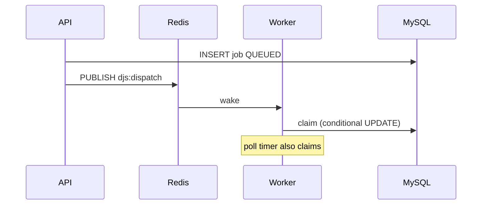

# Rate limiting, distributed locks, and event-driven dispatch

Bonus capabilities layered on the MySQL claim model.

## Rate limiting

Redis fixed-window counters (`INCR` + `EXPIRE`) behind `RateLimitService` / `@RateLimit` / `RateLimitGuard`.

| Scope | Keys | Defaults |
|-------|------|----------|
| Auth (IP) | `rl:auth:{path}:{ip}` | register 5/min, login 8/min, refresh 20/min |
| Mutations (user) | `rl:{name}:{userId}` | e.g. `jobs.create` 60/min, `jobs.retry` 30/min, queue/org/project/schedule/DLQ mutates |

`NODE_ENV=test` bypasses counters so e2e suites stay deterministic.

Responses use HTTP `429` with code `RATE_LIMIT_EXCEEDED` and `retryAfterSeconds` in the error details.

## Distributed locking

`DistributedLockService` uses `SET key token PX ttl NX` and a Lua compare-and-del unlock.

| Lock key | Used by | Purpose |
|----------|---------|---------|
| `djs:lock:stale-recovery` | Worker recovery sweep | Elect one recoverer per interval |
| `djs:lock:promote` | Due-job promotion | Avoid redundant `updateMany` storms |

**Job claim is not Redis-locked.** Claim correctness remains MySQL conditional `UPDATE … WHERE status = 'QUEUED'` plus `queues FOR UPDATE` for capacity ([concurrency.md](./concurrency.md)). Redis locks only coordinate background sweeps.

## Event-driven execution

Channel `djs:dispatch` (`DISPATCH_WAKE_CHANNEL`):

1. API (or worker promote) publishes a `DispatchWakeEvent` when jobs become claimable.
2. Each worker’s `DispatchWakeSubscriber` receives the message and triggers an immediate claim tick.
3. Periodic poll (`WORKER_POLL_INTERVAL_MS`) remains the reliability fallback if Pub/Sub is delayed or Redis is briefly unavailable.

MySQL stays the source of truth for queue state. Wake events are hints, not a second work queue.

Related metrics: `djs_worker_dispatch_wakes_total`.
