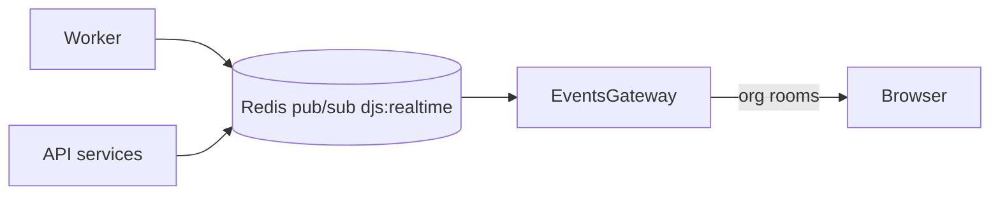

# Realtime updates (WebSockets)

Phase 14 streams job/queue/DLQ/worker changes to the dashboard over **Socket.IO**, with Redis as the cross-process bus so workers and the API stay in sync.

## Architecture

1. API and worker publish `RealtimeEvent` JSON on channel `djs:realtime`.
2. `EventsGateway` subscribes and emits into Socket.IO rooms:
   - `org:{organizationId}` for job/queue/DLQ/dashboard events
   - `platform` for worker registry events
3. The web client connects with the JWT access token, joins its org room, and invalidates React Query caches.

## Client protocol

| Direction | Event | Notes |
|-----------|-------|--------|
| Server → client | `realtime.ready` | After successful JWT auth |
| Client → server | `subscribe.org` | Body `{ organizationId }` — requires VIEWER+ membership |
| Client → server | `unsubscribe.org` | Leave org room |
| Server → client | `job.updated` / `queue.updated` / `dlq.updated` / `dashboard.refresh` / `worker.updated` | Payload + `at` timestamp |

Auth: `handshake.auth.token` (preferred) or `Authorization: Bearer …`.

Namespace: `/realtime` · path: `/socket.io` (Vite proxies WS in dev).

## Shared contract

`@djs/shared-types`: `REALTIME_REDIS_CHANNEL`, `RealtimeEvent`, `RealtimeEventType`.

## UI

Header shows a **live** indicator when the socket is connected. Dashboard poll interval drops to 30s as a safety net.
