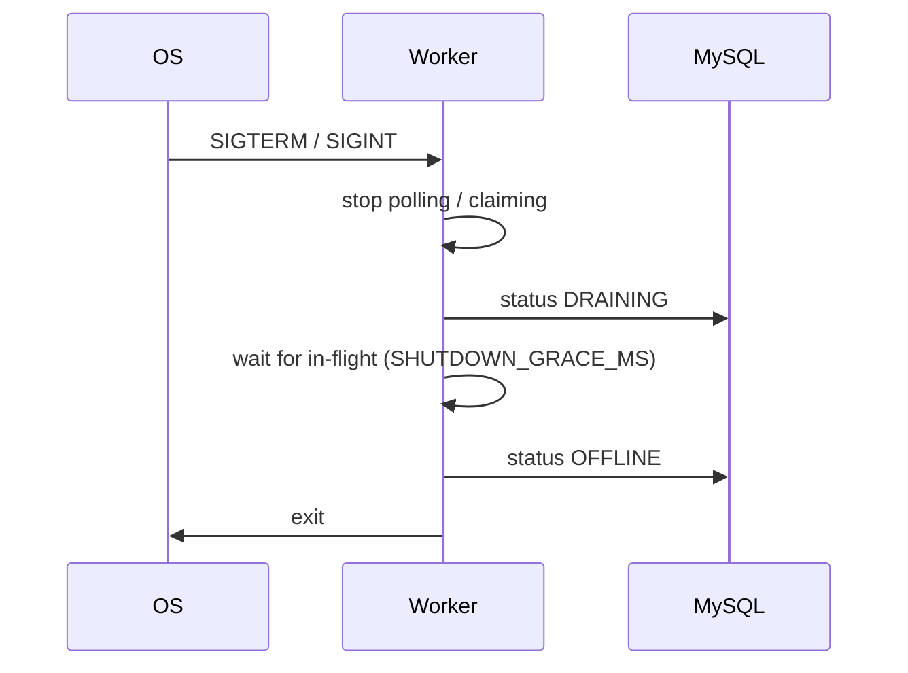

# Reliability

How the platform survives worker crashes, partial failures, and restarts without double-running or losing jobs. Companion docs: [concurrency.md](./concurrency.md), [heartbeat-recovery.md](./heartbeat-recovery.md), [retry-strategies.md](./retry-strategies.md), [dlq.md](./dlq.md).

## Guarantees (practical)

| Property | Approach |
|----------|----------|
| At-most-one active claim | Conditional `UPDATE` on `status = QUEUED` |
| Queue concurrency ceiling | `queues FOR UPDATE` + count `CLAIMED`/`RUNNING` |
| Crash mid-job | Heartbeat timeout → recover to `RETRYING` or `DLQ` |
| Graceful deploy/stop | SIGTERM → `DRAINING` → wait `SHUTDOWN_GRACE_MS` → `OFFLINE` |
| Idempotent create | Optional `Idempotency-Key` / `idempotencyKey` per project |
| Permanent failure | `dead_letter_jobs` + operator retry/discard |
| Durable history | Never overwrite `job_executions`; append logs |

Exactly-once **side effects** are not promised (handlers may have run before a crash). Operators should make handlers idempotent where business-critical; the platform provides at-most-once **claim** plus retry/DLQ.

## Worker liveness

1. On start: insert/update `workers` (`STARTING` → `ONLINE`), stable `workerId` (hostname+pid or `WORKER_ID`).
2. Periodic heartbeat: update `workers.lastHeartbeatAt` and append `worker_heartbeats`.
3. Stale recovery loop (any healthy worker):
   - Mark silent workers `FAILED` when `now - lastHeartbeatAt > HEARTBEAT_TIMEOUT_MS`.
   - For orphaned `CLAIMED`/`RUNNING` jobs locked by failed/missing workers → close execution as `TIMEOUT`, then `RETRYING` (backoff) or `DLQ`.
4. Prune old heartbeat rows per `HEARTBEAT_RETENTION_DAYS`.

Details and timing knobs: [heartbeat-recovery.md](./heartbeat-recovery.md).

## Graceful shutdown

Compose sets `stop_grace_period: 35s` so Docker does not SIGKILL before drain completes.

## Retry and DLQ

Transient failures → `RETRYING` with FIXED / LINEAR / EXPONENTIAL backoff ([retry-strategies.md](./retry-strategies.md)). Exhausted attempts → `DLQ` + `dead_letter_jobs`. Operators can retry, discard, or resolve via API/UI ([dlq.md](./dlq.md)).

## Pause / cancel

- **Pause queue:** workers skip `PAUSED` queues when selecting candidates; in-flight jobs finish.
- **Cancel job:** allowed from `QUEUED` / `SCHEDULED` / `RETRYING` / `CLAIMED`; open executions closed as `CANCELLED`. Running handlers cooperate via abort where implemented.

## Multi-worker safety

Scale with Compose (`docker-compose.scale.yml`). Each process has a unique `workerId`. Claim races are safe by construction; capacity is enforced per queue across all workers. Stale recovery is safe if multiple workers run it (conditional updates).

## Observability hooks

- `/health` / `/health/ready` — dependency gates for orchestrators
- `/metrics` — Prometheus counters for claims, failures, HTTP, queue depth
- Realtime events — operators see state changes without waiting for poll intervals

See [metrics-health.md](./metrics-health.md) and [realtime.md](./realtime.md).

## Failure mode cheat sheet

| Symptom | Likely cause | Mitigation |
|---------|--------------|------------|
| Job stuck `RUNNING` | Worker OOM / kill -9 | Heartbeat recovery |
| Duplicate business email | Handler not idempotent after retry | Dedupe in handler using `jobId` / idempotency key |
| Queue under-utilized | Old SKIP LOCKED-only claim | Use current claim algorithm |
| Cascade of retries | Shared `nextRetryAt` without jitter | Set `jitterRatio` on policy |
| API 503 ready | MySQL/Redis down | Compose healthchecks; fix `DATABASE_URL` / `REDIS_HOST` |
